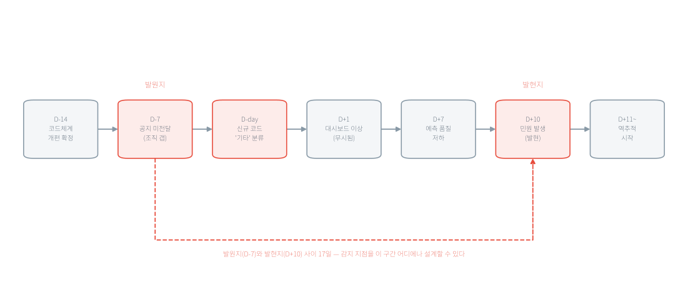

# 1주차 데이터는 어떻게 모델까지 가고, 그사이에 무엇이 깨질까

> **1주차 · 데이터 엔지니어링과 MLOps**
>
> 이 장의 수치는 모두 `practice/chapter1/`의 코드를 실행해 얻은 값이다. 예시를 위해 지어낸 숫자는 없다. 인용한 값의 출처 파일은 출력 블록 첫 줄에 적었다.

□ 이 장은 도구를 배우는 장이 아님  
  ○ Kafka·Airflow·MLflow 같은 이름은 4주차 이후에 하나씩 나옴  
  ○ 지금 확인할 것은 하나임 — **데이터가 어딘가에서 들어와 모델의 판단으로 나가기까지 어떤 단계를 거치고, 그 사이 어디가 조용히 깨지는가**  
□ 이 장은 설명과 실습을 나누지 않음  
  ○ 절마다 실행할 명령이 나오고 그 아래에 실제 출력과 해석이 이어짐  
  ○ 순서대로 실행하면 이 장의 모든 수치를 직접 만들어 냄  
□ 실행 대상은 저장소에 들어 있는 **실제 공공 API 응답**임  
  ○ 한국환경공단 에어코리아 대기오염정보를 실제로 한 번 호출해 받아 둔 원본 파일임  
  ○ 인증키 없이, 인터넷 연결 없이 그대로 읽어 실습함  

## 1. 오늘의 질문

□ 공공 API에서 JSON 파일을 하나 받았으면 데이터 수집이 끝난 것일까?  
□ 프로그램이 오류 없이 끝났는데도 그 안의 데이터가 틀릴 수 있을까?  
□ 분석가가 쓰는 파이썬 스크립트(script)와 운영 중인 데이터 파이프라인(pipeline)은 무엇이 다를까?  
□ 데이터 엔지니어링(Data Engineering, DE)과 MLOps는 어디에서 만날까?  

□ 한 문장으로 미리 답해 두면 이렇다  
  ○ **데이터 엔지니어링은 믿을 수 있는 데이터를 계속 공급하는 일이고, MLOps는 그 데이터로 만든 모델을 계속 검증하며 운영하는 일이다**  
  ○ 둘을 따로 떼어 관리하면 데이터 문제를 모델 문제로 오해하기 쉬움  

## 2. 이 장에서 실행할 것

□ 데이터가 모델까지 가는 길은 학교 급식이 밥상에 오르는 길과 단계가 하나씩 대응함  

| 급식 | 시스템 | 여기서 잘못되면 |
|---|---|---|
| 식재료 납품 | 원천 데이터 | 어디서 언제 왔는지 모르면 원인을 못 찾는다 |
| 검수와 입고 | 수집 | 수량을 세지 않으면 누락을 늦게 안다 |
| 냉장·상온 보관 | 저장 | 원본을 버리면 다시 만들 수 없다 |
| 세척·조리 | 변환 | 형식만 바꾸고 의미를 놓치면 값이 왜곡된다 |
| 배식 | 제공 | 정해진 시간과 형식을 어기면 받는 쪽이 깨진다 |
| 조리법 | 모델 | 재료가 바뀌면 같은 조리법도 결과가 달라진다 |
| 배식 후 관찰 | 모니터링 | 안 보면 언제부터 나빠졌는지 모른다 |

**표 1.1** 급식과 데이터 시스템의 단계 대응. 앞의 다섯 줄이 데이터 엔지니어링, 뒤의 두 줄이 MLOps에 가깝다.

□ 이 대응에서 가져갈 것은 둘임  
  ○ 좋은 조리법으로 상한 재료를 되살릴 수 없듯, 좋은 모델로 잘못된 데이터를 되살릴 수 없음  
  ○ 입고 기록이 없으면 문제 재료를 못 찾듯, 데이터 기록이 없으면 잘못된 예측의 원인을 못 찾음  
□ 비유는 여기까지다  
  ○ 상한 재료는 냄새로 알지만, **상한 데이터는 겉모습이 그대로임**  
  ○ 오히려 파일도 만들어지고 프로그램도 정상 종료함  
  ○ 이 차이가 4절에서 처음 숫자로 나타남  

□ 실행하기 전에 네 가지를 먼저 적음  
  ○ 산출물을 먼저 열면 거기 적힌 값이 정답처럼 보여 "왜 이 값인가"를 묻지 않게 됨  

**표 1.2** 예측표 — 실행하기 **전에** 채운다

| 예측할 것 | 내 예측 | 실제 | 어긋났다면 원인 |
|---|---|---|---|
| 측정소 레코드 하나에 필드가 몇 개 있을까 | | | |
| 측정값 `21`은 숫자로 올까 문자열로 올까 | | | |
| 측정 장비가 멈추면 그 값은 어떻게 표시될까 | | | |
| 미세먼지 농도만 보면 그 측정소의 등급을 되계산할 수 있을까 | | | |

□ 예측 칸에 "그럴 것 같아서"라고 쓰지 않음  
  ○ 측정소가 옥외에 놓인 물리 장비라는 점, 응답이 JSON이라는 점처럼 **이미 아는 사실**에서 끌어냄  

□ 이 장에서 실행할 코드는 넷이고 순서가 정해져 있음  

| 순서 | 실행할 파일 | 하는 일 | 절 | 선행 조건 |
| ---: | --- | --- | ---: | --- |
| 1 | `1-2-response-layers.py` | 응답의 두 계층과 레코드 23필드를 읽음 | 3 | Python만 |
| 2 | `1-3-silent-failure.py` | 침묵 실패 세 가지를 실제 응답 위에서 재현 | 4 | Python만 |
| 3 | `1-4-collector-checks.py` | 자동 검사 넷을 걸어 잘린 응답을 잡아냄 | 5 | Python만 |
| 4 | `1-5-feature-rule-skew.py` | 같은 피처를 두 규칙으로 계산해 갈라지는 지점을 봄 | 6 | Python만 |
| 선택 | `1-1-public-api.py` | 인증키로 공공 API를 직접 호출해 새 응답을 받음 | 3 | `requests` + 인증키 |

○ 1~4번은 표준 라이브러리만 쓰고 인터넷도 쓰지 않음. 설치할 패키지가 없음  
○ 선택 항목만 공공데이터포털 인증키가 필요함  

### 시작 전 준비

□ 저장소 루트에서 아래 한 줄을 실행해 Python 버전과 실습 폴더 상태를 점검함  

```bash
python scripts/setup_practice.py 1
```

□ 인증키는 이 장에서 **없어도 됨**  
  ○ 1~4번 실습은 저장소에 들어 있는 실제 응답 파일을 읽으므로 키가 필요 없음  
  ○ 선택 항목을 해 보려면 공공데이터포털에서 활용신청을 한 뒤 환경변수에 넣음  
    – Windows PowerShell: `$env:DATA_GO_KR_API_KEY="발급받은 키"`  
    – macOS·Linux: `export DATA_GO_KR_API_KEY="발급받은 키"`  
  ○ 인증키를 코드나 문서에 직접 적지 않음. 키가 적힌 파일은 커밋되는 순간 공개된 것으로 봄  

## 3. 공공 API가 보내는 것은 숫자 묶음이 아니라 두 계층이다

□ 수집은 원천에서 데이터를 가져오는 단계임  
  ○ 가져온 것이 무엇인지 정확히 읽지 못하면 뒤의 모든 단계가 그 오해 위에 쌓임  
  ○ 그래서 첫 주의 첫 작업은 "무엇을 받았는가"를 눈으로 확인하는 일임  
□ 공공 API가 돌려주는 것은 보통 **JSON**임  
  ○ JSON은 `"이름": 값` 쌍을 중괄호로 묶어 적는 텍스트 형식임  
    – 값 자리에 다시 묶음이 들어갈 수 있어 **계층**이 생김  
    – 사람도 읽을 수 있고 프로그램도 바로 읽을 수 있어 공공 API의 기본 형식으로 쓰임  
  ○ 계층이 있다는 점이 실무에서 중요함  
    – 필요한 값이 어디에 들어 있는지 **경로**로 짚어야 하기 때문임  
    – 이 응답에서 측정소 목록의 경로는 `response.body.items`임  
□ 공공 API의 응답은 보통 두 계층으로 나뉨  
  ○ **header**는 "요청 처리가 업무적으로 성공했는가"를 담음  
  ○ **body**는 "무엇이 몇 건 왔는가"를 담음  
  ○ 두 계층을 나눠 두는 까닭은 **HTTP 통신이 성공한 것과 업무가 성공한 것이 다르기 때문**임  
    – 인증키가 만료돼도 서버는 HTTP 요청 자체는 처리했으므로 200을 돌려줄 수 있음  
    – 이때 "키가 만료됐다"는 사실은 header 안의 업무 코드로 전달됨  
□ body 안에는 건수를 세는 자리가 셋이나 됨  
  ○ `totalCount`는 서버가 가진 전체 건수임  
  ○ `numOfRows`는 이번 요청이 허용한 한 페이지 최대 건수임  
  ○ `items`의 길이는 이번 응답으로 실제 받은 건수임  
  ○ 셋을 구분하지 않으면 다음 절에서 볼 누락을 알아차릴 수 없음  
    – 전체가 250건인데 한 페이지 한도가 100건이면, 한 번만 부른 코드는 100건을 받고 끝남  
    – 이때 `items`의 길이는 100이고 `totalCount`는 250이므로, 두 수를 비교하면 곧바로 드러남  
□ 측정소 레코드 하나는 값 하나가 아니라 **값·등급·플래그(flag)의 묶음**임  
  ○ `pm10Value`는 측정값, `pm10Grade`는 그 측정소의 등급, `pm10Flag`는 측정 상태 표시임  
  ○ 값만 저장하고 등급과 플래그를 버리면, 나중에 "이 결측이 왜 생겼는가"를 되짚을 근거가 사라짐  
    – 값이 비어 있을 때 플래그에는 점검·교정 같은 사유가 들어오게 설계돼 있음  
□ 필드 이름이 규칙을 따르면 코드가 짧아짐  
  ○ 측정 항목마다 `{항목}Value`·`{항목}Grade`·`{항목}Flag` 세 이름이 그대로 반복됨  
  ○ 이 규칙을 읽어 두면 항목이 하나 늘어도 코드를 고치지 않아도 됨  

□ 첫 번째 코드를 실행함. 이 절의 숫자는 전부 이 명령의 출력임  

```bash
cd practice/chapter1
python3 code/1-2-response-layers.py
```

```text
# 출처: practice/chapter1/results/1-2-response-layers.log
[1] 응답의 두 계층
    response.header   resultCode=00  resultMsg=NORMAL_CODE
    response.body     totalCount=40  pageNo=1  numOfRows=100  items=40건

[2] 레코드 하나의 필드 23개
    값·등급·플래그가 한 묶음인 측정 항목 6종: so2, co, o3, no2, pm10, pm25
      → 6종 x 3 = 18개
    나머지 5개: dataTime, khaiGrade, khaiValue, sidoName, stationName

[3] 첫 레코드
    stationName  '정릉로'
    dataTime     '2026-06-28 22:00'
    pm10Value    '21'
    pm10Grade    '2'
    pm10Flag     None

[4] 숫자처럼 보이는 값의 자료형
    문자열로 온 숫자 필드 14개: coGrade, coValue, khaiGrade, khaiValue, no2Grade, …
    JSON 숫자로 온 필드: totalCount=40, pageNo=1, numOfRows=100

[5] 건수를 세는 자리가 셋이다
    totalCount   40  서버가 가진 전체 건수
    numOfRows   100  이번 요청이 허용한 한 페이지 최대 건수
    items        40  이번 응답으로 실제 받은 건수
    받은 건수 == 전체 건수: 예  (한 페이지에 다 들어옴)
```

□ 화면에 나온 값에서 읽을 것  
  ○ **필드가 23개** — 측정 항목 6종에 값·등급·플래그가 각각 붙어 18개가 되고, 여기에 측정 시각·시도명·측정소명과 통합지수 두 필드가 더해짐. "측정소 하나에 미세먼지 값 하나"라고 예측했다면 여기서 어긋남  
  ○ **측정값이 문자열로 옴** — `pm10Value`는 숫자 21이 아니라 문자열 `'21'`임. 숫자로 바꾸는 단계가 반드시 끼어들고, 그 단계가 다음 절 침묵 실패의 출발점이 됨  
  ○ **`pm10Flag`가 `None`임** — 플래그 자리가 비어 있음. 플래그가 비었다고 결측이 없는 것은 아니며, 그 근거를 다음 절에서 봄  
  ○ **이번 호출은 한 페이지에 다 들어옴** — `totalCount` 40이 `numOfRows` 100보다 작아 한 번에 다 받았음. 이 조건이 깨지는 순간이 누락이 시작되는 순간임  

> - **한 번 잘 돌았다는 것이 구조를 보장하지 않는다**
> - 이 응답은 검사 없이도 온전했다. `totalCount`가 우연히 `numOfRows`보다 작았기 때문이다.
> - 측정소가 늘거나 조회 범위를 전국으로 넓히면 같은 코드가 조용히 일부만 저장한다.

## 4. 침묵 실패 — 프로그램은 성공했는데 데이터가 틀렸다

□ 프로그램이 멈추고 빨간 오류 메시지를 뱉으면 그나마 다행임  
  ○ 그때는 누구나 알아차림  
□ 데이터 시스템에서 진짜 위험한 것은 **프로그램이 정상 종료하고 파일도 만들어졌는데 그 안의 데이터가 틀린 경우**다  
  ○ 이것을 침묵 실패(silent failure)라고 부르며, 이 과목 전체에서 반복해 나옴  
□ 전형이 셋 있음  

□ **결측을 0으로 바꾼 경우**  
  ○ 측정 장비가 점검 중이거나 통신이 끊기면 API는 값 대신 `"-"`나 `null`을 돌려줌  
  ○ 이 값을 숫자로 바꿔야 하니 편의상 0으로 채우면 코드는 아무 오류 없이 돌아감  
  ○ 그런데 그 0은 "농도 0", 곧 **대기질이 가장 좋다**는 뜻으로 읽힘  
    – 측정에 실패한 순간이 최고 등급 기록으로 바뀐 것임  
  ○ 결측은 0이 아니라 결측으로 남겨야 함  

□ **페이지네이션(pagination)을 처리하지 않은 경우**  
  ○ API는 한 번에 돌려주는 건수에 한도가 있음  
    – 전체가 40건인데 한도가 20건이면 나머지 20건은 다음 요청으로 받아야 함  
  ○ 이 확인을 빠뜨린 수집기는 오류 없이 20건만 저장함  
  ○ 절반이 조용히 사라졌지만 로그에는 성공만 남음  

□ **HTTP 200만으로 성공이라고 판단한 경우**  
  ○ HTTP 상태 코드 200은 서버가 HTTP 요청을 정상적으로 처리했다는 뜻임  
  ○ 이것만으로 요청한 업무까지 성공했다고 단정할 수는 없음  
    – 3절에서 본 대로 업무 성공 여부는 응답 본문의 header에 따로 들어 있음  
  ○ 따라서 HTTP 상태와 응답 본문의 업무 코드를 **각각** 검사해야 함  

□ 두 번째 코드를 실행함. 셋을 실제 응답 위에서 재현함  

```bash
python3 code/1-3-silent-failure.py
```

```text
# 출처: practice/chapter1/results/1-3-silent-failure.log
[1] 이 응답의 결측 — 레코드 40건
    문자열 '-'  1건: khaiValue 1건
    null       242건
      coFlag       40건
      khaiGrade    1건
      no2Flag      40건
      o3Flag       40건
      pm10Flag     40건
      pm10Grade    1건
      pm25Flag     40건
      so2Flag      40건
    khaiValue가 '-'인 측정소: 강남구
    pm10Flag는 40건 모두 null인데 khaiValue는 '-'로 온다 — 결측 표기가 필드마다 다르다

[2] 결측을 0으로 채우면 — khaiValue(통합대기환경지수)
    결측 제외   건수  39  평균 64.9  최소 49  최대 73
    0으로 채움  건수  40  평균 63.3  최소 0  최대 73
    그런데 강남구의 값은 '측정 실패'에서 0, 곧 이 응답에서 가장 좋은 값이 된다
    최솟값이 49에서 0으로 바뀐 것이 그 자리다

[3] 페이지네이션을 빠뜨리면 — 한 페이지를 20건으로 가정해 재현
    totalCount 40  저장한 건수 20  조용히 빠진 건수 20
    pm10 평균   전체 20.0  →  앞 20건만 20.3
    막는 검사는 한 줄이다: len(items) == totalCount  (20 == 40 → False)

[4] HTTP 상태만 검사하면
    이 응답의 업무 코드  resultCode=00  resultMsg=NORMAL_CODE
    막는 검사도 한 줄이다: resultCode == '00'  (현재 '00' → True)

[5] 이번 호출에 결측이 없다는 것과 이 API에 결측이 없다는 것은 다르다
    2026-06-28 22:00 호출  측정소 40개  pm10 결측 0건   (ch1_airquality_live_raw.json)
    2026-08-31 15:00 호출  측정소 40개  pm10 결측 3건   (ch1_api_summary.json)
```

□ 화면에 나온 값에서 읽을 것  
  ○ **결측 표기가 필드마다 다름** — 같은 응답 안에서 `khaiValue`는 `"-"`로, `khaiGrade`와 `pm10Grade`는 `null`로 비어 있음. 한 가지 표기만 걸러 내는 코드는 나머지를 숫자로 오해함  
  ○ **평균은 조금 움직이는데 한 측정소는 뒤집힘** — 통합대기환경지수 평균은 64.9에서 63.3으로 1.6만 내려감. 눈에 띄지 않는 변화임. 그런데 같은 조작으로 강남구 한 곳의 값은 "측정 실패"에서 0, 곧 이 응답에서 가장 좋은 값으로 바뀜  
  ○ **최솟값 49가 0이 된 자리가 그 증거임** — 전체 평균만 보면 결측 0 채우기는 무해해 보이지만, 측정소별로 보면 최악이 최선으로 바뀜. 지도에 등급을 색으로 칠하는 화면이라면 강남구만 초록으로 바뀜  
  ○ **누락 20건을 막는 검사가 한 줄임** — `len(items) == totalCount` 한 줄이면 잡힘. 없으면 pm10 평균이 20.0에서 20.3으로 바뀐 채 조용히 저장됨  
  ○ **결측 0건은 이번 호출의 성질이지 API의 성질이 아님** — 같은 코드가 6월 호출에서는 pm10 결측 0건, 8월 호출에서는 3건을 받았음. "우리 데이터에는 결측이 없다"는 판단은 한 번의 호출로 내릴 수 없음  

> - **평균이 거의 그대로라는 사실이 오히려 위험하다**
> - 64.9와 63.3의 차이로는 무엇이 잘못됐는지 알 수 없다. 대시보드의 전체 평균만 보는 사람에게는 아무 일도 없었던 것처럼 보인다.
> - 침묵 실패는 지표가 크게 튀어서 위험한 것이 아니라, 튀지 않아서 위험하다.

□ 침묵 실패가 위험한 두 번째 이유는 **문제가 시작된 곳과 눈에 보이는 곳이 다르기 때문**임  
  ○ 민원 유형 코드가 다른 부서에서 개편됐는데 파이프라인 담당자에게 공지가 가지 않았다고 하자  
    – 그날부터 새 코드는 매핑되지 않아 전부 "기타"로 분류됨  
    – 며칠 뒤 모델의 예측 품질이 떨어짐  
    – 다시 며칠 뒤 시민이 "민원이 엉뚱한 부서로 갔다"고 항의함  
  ○ 시작은 공지 누락, 처음 나타난 기술 증상은 매핑 실패, 사람이 겪은 증상은 잘못된 배정임  



**그림 1.1** 실패의 연쇄 — 발원지와 발현지 사이의 간극. 날짜는 실제 장애 기록이 아니라 전파 순서를 보여 주기 위해 구성한 시나리오다.

□ 붉은 상자 셋 사이의 거리가 이 그림의 요점임  
  ○ 왼쪽이 발원지(D−7, 공지 미전달), 가운데가 침묵 실패가 시작되는 날(D-day, 전부 "기타"로 분류), 오른쪽이 발현지(D+10, 시민 민원)임  
  ○ 발원지와 발현지 사이에 단계가 셋(D-day·D+1·D+7) 놓여 있고, 그사이 D+1의 대시보드 이상은 임계와 알림이 없어 그냥 지나감  
□ 점선이 지나는 구간 어디에나 감지 지점을 놓을 수 있고, **발원지에 가까울수록 수습이 쌈**  
□ 여기서 얻을 규칙은 하나임  
  ○ **모델 성능만 감시하면 늦는다**  
  ○ 상류의 결측률과 미매핑 비율을 함께 감시해야 문제가 시민에게 닿기 전에 멈출 수 있음  

## 5. 스크립트와 파이프라인의 차이는 검사에 있다

□ 어느 담당자가 매주 월요일 공공 API를 호출해 엑셀 파일을 만드는 파이썬 스크립트를 갖고 있다고 하자  
  ○ 실행하면 결과가 잘 나옴. 그래도 이것을 운영 파이프라인이라고 부르지는 않음  
□ 네 가지가 빠져 있음  
  ○ 담당자가 휴가를 가면 그 주 데이터가 없음  
  ○ API가 빈 응답을 보내도 파일은 생성되므로 성공으로 보임  
  ○ 원본 응답을 저장하지 않았으면 1년 뒤 그 수치의 근거를 확인할 수 없음  
  ○ 담당자가 부서를 옮기면 실행 순서와 인증키 관리 방법이 함께 사라짐  
□ 데이터 엔지니어링은 이 넷을 시스템이 지켜야 할 요구사항으로 바꿈  

| 스크립트의 문제 | 파이프라인의 요구사항 |
|---|---|
| 사람이 실행해야 한다 | 정해진 일정에 자동으로 실행하고, 실패하면 다시 실행한다 |
| 성공했는지 알 수 없다 | 건수·결측률·업무 코드를 검사하고 어긋나면 알린다 |
| 원본이 남지 않는다 | 받은 응답 그대로와 처리 시각을 보존한다 |
| 방법이 사람 머릿속에 있다 | 코드·설정·데이터 형식을 버전으로 관리한다 |

**표 1.3** 스크립트와 파이프라인의 차이

□ 네 요구사항 가운데 이 장에서 직접 만들어 볼 것은 **두 번째, 자동 검사**임  
  ○ 나머지 셋은 뒤 주차의 도구가 맡음 — 원본 보존과 되감기는 3주차, 자동 실행과 재시도는 6주차, 모델과 데이터의 버전 기록은 9주차에서 다룸  
  ○ 검사만은 함수 몇 줄로 지금 만들 수 있고, 효과도 이 장에서 바로 눈에 보임  
□ 검사는 "무엇이 참이어야 하는가"를 코드로 적어 두는 일임  
  ○ 4절에서 본 침묵 실패가 각각 검사 한 줄에 대응함  
    – 업무 코드가 정상인가(`resultCode == "00"`)  
    – 받은 건수가 전체 건수와 같은가(`len(items) == totalCount`)  
    – 필수 필드가 레코드마다 다 있는가  
    – 핵심 측정값의 결측률이 정한 한도 안인가  
□ 검사를 두는 자리는 **받은 직후, 저장하기 전**임  
  ○ 잘못된 데이터가 저장소에 한번 들어가면 그 뒤의 모든 계산이 그것을 읽음  
  ○ 저장한 뒤에 걸러 내려면 어디까지 오염됐는지부터 찾아야 함  
□ 검사가 실패했을 때 무엇을 할지는 **미리 정해 둠**  
  ○ 멈추고 사람에게 알리는 쪽과, 기록만 남기고 그대로 진행하는 쪽 둘 중 하나임  
  ○ 어느 쪽을 고르든 "무엇이 왜 실패했는지"를 남기는 것은 같음  
    – 남기지 않으면 다음 주에 같은 문제가 나도 처음 보는 문제가 됨  
□ 임계는 감으로 정하지 않음  
  ○ 정상으로 판단되는 기간의 실제 값에서 출발해, 놓치면 곤란한 사고를 잡는 선까지 좁힘  
  ○ 이 실습의 결측률 한도 5%도 그렇게 정할 값이며, 지금은 설명을 위해 고정해 두었음  

□ 세 번째 코드를 실행함. 같은 검사를 온전한 응답과 잘린 응답에 각각 걸어 봄  

```bash
python3 code/1-4-collector-checks.py
```

```text
# 출처: practice/chapter1/results/1-4-collector-checks.log
[1] 원본 응답에 검사 네 가지를 적용
    C1 업무 코드  resultCode == '00'                 resultCode=00              통과
    C2 건수     items == totalCount(40)            items=40                   통과
    C3 스키마    필수 5개 필드 전건 존재                     모두 존재                      통과
    C4 결측률    pm10Value 결측률 <= 5.0%              0/40 = 0.0%                통과
    → 4/4 통과

[2] 같은 검사를 잘린 응답(앞 20건)에 적용
    C1 업무 코드  resultCode == '00'                 resultCode=00              통과
    C2 건수     items == totalCount(40)            items=20                   실패
    C3 스키마    필수 5개 필드 전건 존재                     모두 존재                      통과
    C4 결측률    pm10Value 결측률 <= 5.0%              0/20 = 0.0%                통과
    → 3/4 통과, 실패 1건 — 이 응답은 저장하지 않고 멈춘다

[3] 검사가 없으면 무엇이 그대로 지나가는가
    잘린 응답도 JSON으로 저장되고 프로그램은 종료 코드 0으로 끝난다
    바뀌는 것은 숫자 하나뿐이다 — pm10 평균 20.0 → 20.3

[4] 원본 보존 — 같은 입력이면 같은 지문
    원본 items SHA-256  8dc4d5794ce4a7d8…
    잘린 items SHA-256  813f593df2a67505…
    두 지문이 같은가: 아니오
```

□ 화면에 나온 값에서 읽을 것  
  ○ **잘린 응답도 검사 넷 중 셋을 통과함** — 업무 코드도 정상이고 필드도 다 있고 결측률은 오히려 0.0%임. 셋만 보면 이 데이터는 합격임  
  ○ **잡아낸 것은 C2 하나뿐임** — 건수 검사가 없으면 이 응답은 그대로 저장됨. 검사를 여러 개 두는 까닭은 각 검사가 서로 다른 실패를 잡기 때문이며, 하나가 통과했다고 나머지가 통과하지 않음  
  ○ **결측률 0.0%가 합격 신호가 아님** — 잘린 응답의 결측률은 20건 안에서 잰 값임. 애초에 20건이 사라진 사실은 결측률로 드러나지 않음. 지표는 자기가 보는 범위 안에서만 참임  
  ○ **원본 해시가 다름** — 원본과 잘린 응답의 지문이 `8dc4d579…`와 `813f593d…`로 갈림. 원본을 보관해 두면 "그때 받은 것이 이것"이라고 한 줄로 보일 수 있고, 요약만 남겼다면 이 대조 자체가 불가능함  

> - **검사를 통과했다는 말은 '검사한 것에 한해 이상 없다'는 뜻이다**
> - 이 실행은 네 가지만 검사했다. 측정값이 물리적으로 가능한 범위인지, 측정소 목록이 지난 호출과 같은지는 보지 않았다.
> - 검사 목록은 사고가 날 때마다 늘어난다. 2주차에서 이 목록을 데이터 품질 규칙으로 확장한다.

## 6. 두 영역이 만나는 자리는 피처다

□ 데이터 엔지니어링은 원천 데이터를 모델이 사용할 입력값으로 가공함  
  ○ 이 입력값을 **피처(feature)**라고 함  
□ MLOps는 그 피처로 모델을 학습하고 실제 예측을 수행함  
□ 따라서 피처를 만들어 넘기는 자리가 두 영역의 접점이고, 여기서 가장 흔한 사고가 남  
□ 모델을 쓰는 경로는 둘임  
  ○ **학습 경로**는 과거 데이터를 모아 모델을 만드는 길임  
  ○ **서빙 경로**는 새 요청이 들어온 순간 실시간으로 값을 계산해 모델에 넣는 길임  
  ○ 두 경로는 보통 다른 사람이, 다른 시점에, 다른 코드로 만듦  
□ 두 경로가 같은 이름의 피처를 **다른 규칙으로** 계산하면 어떻게 될까  
  ○ 두 코드 모두 정상 실행되지만 모델은 학습할 때와 다른 방식으로 만든 입력을 받음  
  ○ 이것이 **학습-서빙 불일치(training-serving skew)**이며, 오류 메시지 없이 모델 성능만 떨어지는 침묵 실패임  
□ 대기질 자료로 이 상황을 그대로 만들어 볼 수 있음  
  ○ 피처 이름은 `pm10_bad`, 뜻은 "이 측정소의 PM10이 나쁜 상태인가"로 정함  
  ○ 학습 경로는 API가 함께 준 `pm10Grade`를 그대로 씀  
  ○ 서빙 경로는 실시간 화면에서 `pm10Value` 하나만 받아 임계로 등급을 다시 계산함  

□ 네 번째 코드를 실행함. 두 경로가 같은 측정소를 어떻게 다르게 판정하는지 봄  

```bash
python3 code/1-5-feature-rule-skew.py
```

```text
# 출처: practice/chapter1/results/1-5-feature-rule-skew.log
[2] 학습 경로 — API가 준 pm10Grade를 그대로 사용
    나쁨(등급 2 이상) 11곳 / 39곳

[3] 서빙 경로 — pm10Value에 임계 30을 걸어 등급을 다시 계산
    나쁨 0곳 / 39곳
    학습 경로와 어긋난 측정소 11곳
      정릉로      pm10Value=21  pm10Grade=2  학습=1 서빙=0
      신촌로      pm10Value=25  pm10Grade=2  학습=1 서빙=0
      관악구      pm10Value=25  pm10Grade=2  학습=1 서빙=0
      강동구      pm10Value=27  pm10Grade=2  학습=1 서빙=0
      천호대로     pm10Value=22  pm10Grade=2  학습=1 서빙=0
      … 외 6곳
    두 경로 모두 예외를 내지 않는다. 어긋난 것은 오류가 아니라 값이다

[4] 임계를 바꾸면 맞출 수 있는가 — 10부터 34까지 전부 시험
    어긋남이 가장 적은 임계 22  그래도 6곳이 어긋남

[5] 0이 되는 임계가 없는 이유 — 값의 범위가 겹친다
    학습 라벨 0(등급 1)  28곳  pm10Value 14~27
    학습 라벨 1(등급 2)  11곳  pm10Value 20~27
    두 범위가 겹치는 값: 20, 21, 22, 27

[6] 규칙을 맞춰도 남는 것 — 입력 자체가 시간이 지나면 달라진다
    2026-06-28 22:00  측정소 40개  pm10 평균 20.0  결측 0건   (ch1_airquality_live_raw.json)
    2026-08-31 15:00  측정소 40개  pm10 평균 8.9  결측 3건   (ch1_api_summary.json)
```

□ 화면에 나온 값에서 읽을 것  
  ○ **39곳 중 11곳이 어긋남** — 같은 이름의 피처가 측정소 11곳에서 다른 값을 냄. 두 경로 다 종료 코드 0으로 끝나고, 어디에도 오류가 남지 않음  
  ○ **임계를 아무리 잘 골라도 0이 되지 않음** — 10부터 34까지 전부 시험했는데 가장 나은 임계 22에서도 6곳이 어긋남. 규칙이 다른 문제는 숫자 하나를 조정해 메울 수 없음  
  ○ **겹치는 이유가 데이터에 그대로 보임** — 등급 1인 측정소의 값이 14~27이고 등급 2인 측정소의 값도 20~27임. 같은 21이 어떤 측정소에서는 등급 1, 다른 측정소에서는 등급 2임  
  ○ **따라서 값 하나로 등급을 되만들 수 없음** — `pm10Value`와 `pm10Grade`가 같은 규칙으로 만들어진 필드가 아니기 때문임. 서빙 경로가 "값만 있으면 등급은 계산하면 되지"라고 가정한 순간 불일치가 시작됨  

> - **어긋난 원인을 이 실행만으로 단정하지 않는다**
> - 확인된 사실은 하나다 — 두 필드의 값 범위가 겹치므로 어떤 임계로도 등급을 되만들 수 없다.
> - 등급이 어떤 기준으로 산정되는지는 API 제공 기관의 문서에서 확인해야 한다. 규칙을 모르면 그 피처를 두 경로에서 같게 계산할 방법도 없다.

□ 해결 방향은 임계를 고치는 것이 아니라 **정의를 한곳에 두는 것**임  
  ○ 피처의 이름·계산 규칙·입력 필드를 한 군데 적어 두고 두 경로가 그것을 참조하게 함  
  ○ 이 구조를 맡는 도구가 **피처 스토어(Feature Store)** 이며 7주차에서 직접 만듦  
□ 무엇을 피처로 쓸 수 있는지에도 규칙이 하나 붙음  
  ○ 피처는 **예측하는 순간에 알 수 있었던 정보로만** 이루어져야 함  
  ○ 민원 처리 지연을 예측하는 모델이라면 민원 종류와 접수 부서는 쓸 수 있지만, 실제 처리 완료일은 쓸 수 없음  
    – 처리 완료일을 넣으면 학습 성능은 높게 나오지만, 새 민원이 접수된 순간에는 그 값이 아직 없음  
  ○ 이 오류를 **미래 정보 누출(future leakage)** 이라 하며, 9주차에서 다시 만남  

### 규칙을 맞춰도 남는 것

□ 두 경로의 규칙을 같게 맞춰도 끝이 아님  
  ○ 같은 API를 같은 코드로 두 번 불렀을 뿐인데 6월 평균은 20.0, 8월 평균은 8.9임  
  ○ 결측도 0건에서 3건으로 바뀜  
  ○ 두 호출은 계절도 시각도 다르므로 이 차이의 원인을 하나로 지목할 수는 없음  
  ○ 지목할 수 있는 사실은 하나임 — **코드를 한 줄도 고치지 않아도 모델이 받는 값은 시간이 지나면 달라짐**  
□ 모델은 과거 데이터에서 배운 관계를 그대로 적용하는데 그 관계 자체가 흐려짐  
  ○ 이것을 **드리프트(drift)** 라 하며 11주차에서 재는 방법을 다룸  
□ 그래서 MLOps는 한 방향으로 끝나는 절차가 아니라 순환임  


**그림 1.2** 데이터 공급부터 모델 감시까지의 연결. 위쪽은 데이터 엔지니어링, 아래쪽은 MLOps에 해당하며, 모니터링 결과가 다시 모델 개발로 돌아온다.

□ 이 순환에는 성질이 하나 붙음  
  ○ **하나를 바꾸면 다른 것이 함께 달라짐** — 데이터를 하나 더 넣으면 모델이 달라지고, 모델이 달라지면 응답 분포가 달라지고, 그러면 감시 기준도 다시 정해야 함  
□ 일반 소프트웨어 개발에서는 코드만 버전으로 관리하면 되지만 여기서는 **데이터·피처·모델·코드가 함께 움직임**  
  ○ 무엇을 어떤 데이터로 언제 만들었는지 기록해 두지 않으면, 성능이 떨어졌을 때 원인이 어느 쪽인지 나눌 수 없음  
□ 공공 서비스에는 질문이 하나 더 붙음 — **그 시점의 데이터와 모델로 그 결과를 다시 만들 수 있는가**  
  ○ 답하려면 원천 데이터의 시각, 변환 코드와 피처 정의, 모델 버전, 배포 시각이 서로 연결돼 있어야 함  
  ○ 사고가 난 뒤 사람이 기억을 더듬어 쓰는 설명문은 근거가 되지 못하고, 실행 중에 자동으로 남긴 기록이라야 근거가 됨  
  ○ 공공 AI가 사람 대신 결정을 내린다면 시민이 그 결정에 설명을 요구하고 이의를 제기할 수 있어야 함(12주차)  

## 7. 핵심 요약

□ **1. 공공 API 응답은 두 계층이고, 건수를 세는 자리가 셋이다.** (3절)  
  ○ header의 업무 코드와 body의 데이터를 각각 읽어야 하고, `totalCount`·`numOfRows`·`items` 길이를 구분해야 함  
  ○ 이번 응답은 `resultCode=00`, 레코드 40건, 필드 23개였고 측정값은 모두 문자열로 왔음  
  ○ 값·등급·플래그를 함께 보관해야 결측의 원인을 되짚을 수 있음  

□ **2. 침묵 실패는 프로그램이 성공한 채로 데이터가 틀리는 일이다.** (4절)  
  ○ 통합대기환경지수 결측을 0으로 채우자 평균은 64.9에서 63.3으로 1.6만 움직였지만, 강남구 한 곳은 측정 실패에서 이 응답의 최고값으로 바뀌었음  
  ○ 한 페이지만 받고 끝낸 경우 40건 중 20건이 사라졌는데도 프로그램은 정상 종료했음  
  ○ 지표가 크게 튀지 않는다는 점이 침묵 실패의 위험이며, 그래서 모델 성능만 감시하면 늦음  

□ **3. 스크립트와 파이프라인의 차이는 검사에 있다.** (5절)  
  ○ 잘린 응답도 검사 넷 중 셋을 통과했고, 잡아낸 것은 건수 검사 하나뿐이었음  
  ○ 결측률은 오히려 0.0%로 나왔음. 지표는 자기가 보는 범위 안에서만 참임  
  ○ 원본을 보관해야 지문 대조가 가능하고, "성공했다" 대신 "무엇을 확인하고 성공이라 했다"를 남길 수 있음  

□ **4. 두 영역이 만나는 자리는 피처이고, 거기서 학습-서빙 불일치가 생긴다.** (6절)  
  ○ 같은 이름의 피처를 두 규칙으로 계산하자 39곳 중 11곳이 어긋났고, 임계를 10~34 전부 시험해도 최소 6곳이 남았음  
  ○ 등급 1의 값 범위 14~27과 등급 2의 값 범위 20~27이 겹치므로 값 하나로 등급을 되만들 수 없음  
  ○ 해결은 임계 조정이 아니라 피처 정의를 한곳에 두는 것이며, 규칙을 맞춰도 입력 분포가 변하는 드리프트는 따로 남음  

## 8. 과제

□ 실습을 순서대로 실행해 만든 산출물을 LMS에 제출한다  

1. 표 1.2 예측표 — 실행 결과와 대조해 고친 최종본. 텍스트든 이미지든 형식은 무방하다.
2. `practice/chapter1/data/output/ch1_silent_failure.json`
3. `practice/chapter1/data/output/ch1_collector_checks.json`
4. `practice/chapter1/data/output/ch1_feature_skew.json`

□ 인증키를 발급받아 `1-1-public-api.py`까지 실행했다면 `practice/chapter1/data/output/ch1_api_summary.json`도 함께 낸다  
  ○ 인증키가 없어도 과제는 완성됨 — 위 네 가지는 인증키 없이 만들어짐  

□ 이어서 네 가지를 각각 세 문장 이내로 쓴다  

1. 예측표에서 실제와 어긋난 항목 하나를 고르고, 왜 그렇게 예측했는지 쓴다.
2. `ch1_silent_failure.json`의 `khai_zero_filled`에서 `min`을 그대로 옮겨 적고, 평균은 1.6밖에 움직이지 않았는데도 이 값이 왜 문제인지 쓴다.
3. `ch1_collector_checks.json`에서 잘린 응답이 실패시킨 검사의 `id`를 적고, 나머지 셋이 통과한 이유를 쓴다.
4. 저장소의 `ch1_api_summary.json`을 열어 `station_count`·`pm10_reported`·`pm10_missing` 사이에 성립하는 등식을 쓰고, `ch1_feature_skew.json`의 `mismatch_count`를 근거로 학습-서빙 불일치를 한 문장으로 설명한다.

□ 값을 지어내지 않는다  
  ○ 실행이 안 되면 어디서 막혔는지 그대로 쓴다  
□ 수업일 포함 7일 이내에 제출한다  

## 9. 더 알아보기

□ 실습을 더 해 보려면 `practice/chapter1/`에서 다음을 시도함  
  ○ `1-3-silent-failure.py`의 `TRUNCATE_ROWS`를 5·10·30으로 바꿔, 몇 건을 버려야 pm10 평균이 눈에 띄게 달라지는지 찾음  
  ○ `1-4-collector-checks.py`에 검사를 하나 더 추가함. 예를 들어 측정값이 물리적으로 가능한 범위인지 보는 검사를 넣고, 온전한 응답이 여전히 통과하는지 확인함  
  ○ `1-5-feature-rule-skew.py`의 `SERVING_THRESHOLD`를 바꿔 가며 어긋나는 측정소 목록이 어떻게 달라지는지 봄  
  ○ 공공데이터포털에서 인증키를 발급받아 `1-1-public-api.py`로 지금 시각의 응답을 받아 보고, 저장소의 6월·8월 값과 나란히 놓아 봄  
□ 뒤 주차에서 이어지는 내용  
  ○ 5절에서 만든 검사 목록은 2주차에서 데이터 품질 규칙으로 확장함  
  ○ 수집·저장·처리·서빙·모니터링을 나누는 설계는 3주차에서 다룸  
  ○ 피처 정의를 한곳에 모으는 피처 스토어는 7주차, 미래 정보 누출은 9주차에서 다룸  
  ○ 드리프트를 재는 방법은 11주차, 공공 AI 결정에 대한 설명과 이의제기는 12주차에서 다룸  
□ 원문을 직접 보고 싶다면 다음 둘이 출발점임  
  ○ RFC 9110 §15, 「HTTP Semantics — Status Codes」 — HTTP 상태 코드의 정의. https://www.rfc-editor.org/rfc/rfc9110.html#name-status-codes  
  ○ 공공데이터포털 — 인증키 발급과 오픈 API 목록. https://www.data.go.kr  
