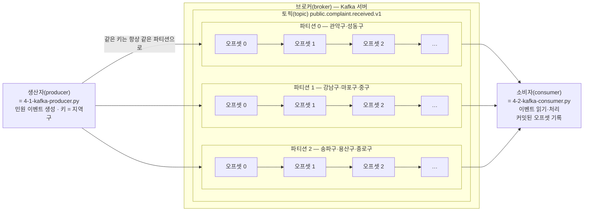

# 4주차 유실과 중복 중에서 무엇을 고를 것인가

> **4주차 · Kafka**
>
> 이 장의 수치는 모두 `practice/chapter4/`의 코드가 남긴 산출물에서 옮긴 값이다. 예시를 위해 지어낸 숫자는 없다. 인용한 값의 출처 파일은 출력 블록 첫 줄에 적었다.
>
> 3·4절의 수치는 Kafka 브로커가 떠 있어야 다시 만들 수 있으므로 **과거 실행이 남긴 산출물에서 옮긴 값**이다. 5·6절의 수치는 브로커 없이 지금 다시 실행해 얻은 로그에서 옮겼다.

□ 3주차에서 파이프라인을 다섯 계층으로 나누고 수집 계층에 Kafka를 놓았음  
  ○ 그때 미뤄 둔 판단이 하나 있음 — **전달 보증 수준을 무엇으로 할 것인가**  
  ○ 이 장은 그 판단을 코드 한 줄의 위치로 바꿔 보고, 그 결과를 유실 건수와 중복 건수로 확인함  

## 1. 오늘의 질문

□ 토픽에 넣은 순서는 어디까지 보존될까?  
□ 커밋 한 줄을 처리 앞에 두느냐 뒤에 두느냐가 무엇을 바꿀까?  
□ 유실과 중복 중 공공 데이터가 먼저 피해야 할 것은 무엇일까?  
□ 같은 이벤트가 두 번 도착해도 업무 상태가 한 번 반영된 것과 같으려면 무엇이 있어야 할까?  

□ 질문에 나온 낱말(토픽·커밋·처리)은 아직 정의하지 않았음. 2절 첫머리에서 전부 정의한 뒤 시작함  

## 2. 이 장에서 실행할 것

### 용어부터 — 이 장에서 쓰는 낱말 아홉 개

□ 각 용어는 앞에 나온 용어만 써서 정의함. 위에서 아래로 읽으면 모르는 낱말 없이 이어짐  

> - **Kafka**: 여러 프로그램 사이에서 이벤트를 받아 저장하고 전달하는 이벤트 스트리밍 시스템이다. 여기서 이벤트는 "○월 ○일 ○시에 강남구에서 소음 민원이 접수됐다"처럼 일어난 일 하나를 적은 데이터 한 건이다.
> - **브로커(broker)**: 이벤트를 받아 저장하고 전달하는 Kafka 서버다. 이 실습에서는 Docker 컨테이너로 실행한다.
> - **토픽(topic)**: Kafka 안에서 같은 종류의 이벤트를 모으는 이름 붙은 통로다. 예를 들어 민원 접수 이벤트와 처리 완료 이벤트를 서로 다른 토픽에 담을 수 있다.
> - **파티션(partition)**: 하나의 토픽을 여러 갈래로 나눈 이벤트 저장 단위다. 이벤트 순서는 파티션 안에서만 보장된다 — 왜 그런지가 3절의 주제다.
> - **오프셋(offset)**: 파티션 안에서 이벤트마다 붙는 위치 번호다. 0부터 시작해 1씩 늘어나며, 파티션마다 따로 센다.
> - **생산자(producer)**: 새 이벤트를 만들어 브로커에 보내는 프로그램이다. 이 실습에서는 `4-1-kafka-producer.py`가 생산자다 — 민원 접수 이벤트를 만들어 브로커에 보낸다. 실제 공공 시스템이라면 시민의 민원을 받아 접수 이벤트를 만드는 민원 접수 시스템이 이 자리에 선다.
> - **소비자(consumer)**: 브로커에 저장된 이벤트를 읽어 분석하거나 업무 시스템에 반영하는 프로그램이다. 이 실습에서는 `4-2-kafka-consumer.py`가 소비자다 — 이벤트를 읽어 처리 기록 파일에 저장한다. 실제 시스템이라면 접수 현황을 집계하는 통계 프로그램이나 담당 부서 배정 시스템이 이 자리에 선다.
> - **처리(process)**: 소비자가 읽어 온 이벤트 한 건으로 해야 할 일을 실제로 끝내는 것이다. 이 실습에서 처리는 이벤트를 처리 기록 파일에 저장하는 일이고, 실제 시스템이라면 데이터베이스 반영이나 담당 부서 배정 같은 업무 동작이다. 읽기와 처리는 별개 단계라서, 읽어 놓고 처리를 끝내기 전에 죽는 경우가 생긴다 — 그때 무슨 일이 벌어지는지가 4절의 주제다.
> - **커밋(commit)**: 소비자가 "여기까지 처리했다"고 현재 오프셋을 Kafka에 기록하는 동작이다. 소비자가 장애 후 다시 시작할 위치가 이 값으로 정해진다. 이 장의 커밋은 Git 저장소에 변경 사항을 기록하는 커밋과 무관하다.
> - Python 가상환경의 `kafka-python`은 브로커가 아니라, 생산자와 소비자가 브로커에 접속할 때 사용하는 클라이언트 라이브러리다.

<div style="page-break-inside: avoid;">



**그림 4.1** Kafka 용어의 관계 — 생산자가 키(지역구)를 붙여 보낸 이벤트를 브로커가 토픽의 파티션 3개에 나누어 저장하고, 소비자가 파티션마다 0부터 붙는 오프셋 순서로 읽는다. 순서 보장 범위가 토픽 전체가 아니라 파티션 하나인 이유가 이 구조에 있으며, 지역구와 파티션의 대응은 3절 첫 실행이 남긴 실측값이다.

</div>

### 커밋 시점이 왜 문제인가

□ 소비자는 세 동작을 반복함 — 이벤트를 **읽고**, **처리하고**, 커밋으로 **오프셋을 기록함**. 셋은 별개 동작이라 순서를 코드가 정해야 함  
  ○ Kafka는 커밋된 오프셋만 알고, 소비자가 처리를 실제로 끝냈는지는 알지 못함  
  ○ 재시작한 소비자는 무조건 커밋된 오프셋부터 읽음. 그러므로 커밋 시점과 장애 시점의 앞뒤 관계가 결과를 정함  
□ 처리하기 전에 커밋부터 하는 경우 — 커밋 후 처리를 끝내기 전에 소비자가 죽으면, 재시작한 소비자는 커밋된 위치부터 읽으므로 처리하지 못한 이벤트를 건너뜀 → **유실**  
□ 처리를 끝낸 뒤에 커밋하는 경우 — 처리 후 커밋하기 전에 죽으면, 재시작한 소비자는 마지막 커밋 위치부터 다시 읽으므로 이미 처리한 이벤트를 다시 처리함 → **중복**  
□ 두 가지를 미리 적어 둠  
  ○ 커밋된 오프셋은 토픽 전체에 하나가 아니라 **파티션마다 따로** 기록됨  
  ○ 같은 이벤트를 두 번 처리해도 시스템은 오류도 표시도 남기지 않음. 이 침묵이 5절에서 저장된 행 수로 드러남  

### 시작 전 준비

□ 3·4절은 실제 Kafka 브로커에 이벤트를 보내고 받으므로 Docker Desktop이 필요함. 아직 없다면 먼저 설치함(아래 점검 스크립트는 Docker를 확인만 하고 설치해 주지 않음)  
  ○ **Windows** — 터미널에서 `winget install -e --id Docker.DockerDesktop`을 실행하거나, docker.com에서 설치 파일을 내려받아 실행함. 설치 중 "Use WSL 2" 기본값을 그대로 두고, 재부팅을 요구하면 재부팅함  
  ○ `winget` 명령이 없다고 나오면(Windows 10 일부 환경) docker.com에서 내려받는 경로를 쓰면 됨. 설치 도중 화면이 어두워지며 허용 여부를 묻는 창(UAC)이 뜨면 "예"를 누름  
  ○ **macOS** — docker.com에서 자기 칩(Apple silicon / Intel)에 맞는 설치 파일을 내려받아 설치함  
  ○ 설치 후 Docker Desktop 앱을 실행하고 약관에 동의함. 이후 실습 때마다 이 앱을 먼저 켜 두어야 함(9절의 도커 데몬 참조)  
  ○ 터미널에서 `docker ps`를 쳐서 오류 없이 표 머리글이 나오면 준비된 것임  
□ 터미널에서 실습 저장소 루트(`mlops_public` 폴더)로 이동함 — 이 절의 나머지 명령은 모두 이 위치에서 실행함  
  ○ 예: 저장소를 `Documents` 아래에 내려받았다면 `cd Documents/mlops_public` (Windows PowerShell도 같은 형식)  
  ○ 저장소가 아직 없다면 `git clone https://github.com/LeeSeogMin/mlops_public.git`으로 내려받은 뒤 이동함  
  ○ `ls`(또는 `dir`)를 쳐서 `scripts`·`practice` 폴더가 보이면 올바른 위치임  
□ 다음 명령이 Python·Docker·포트(2181·9092·29092)를 점검하고 가상환경과 `kafka-python`을 준비함  

```bash
python scripts/setup_practice.py 4
```

□ 저장소 루트에서 아래 명령으로 Kafka 브로커를 올림  

```bash
cd practice/chapter3 && docker compose up -d zookeeper kafka
```

**표 4.1** 이 장에서 지켜볼 관찰 항목 네 개 — 각 절의 실행 결과에서 이 값을 찾아 읽는다(UPSERT는 5절에서 정의함 — 같은 이벤트가 두 번 와도 행 하나를 유지하는 저장 방식)

| 관찰 항목 | 값을 결정하는 것 | 절 |
|---|---|---:|
| 200건을 지역구 8개 키로 파티션 3개에 보냈을 때, 파티션별 건수 | 파티션 번호는 키에서 계산으로 정해지므로(계산 방법은 3절), 분포는 설정값이 아니라 키 선택의 결과다 | 3 |
| 처리하기 전에 **커밋부터** 한 소비자가 10건 처리 후 죽었을 때 — 유실·중복 건수 | 재시작한 소비자는 커밋된 오프셋부터 읽으므로, 커밋 후 처리하지 못한 이벤트는 건너뛴다 | 4 |
| 커밋하기 전에 **처리부터** 한 소비자가 10건 처리 후 죽었을 때 — 유실·중복 건수 | 재시작한 소비자는 마지막 커밋 위치부터 다시 읽으므로, 이미 처리한 이벤트를 다시 처리한다 | 4 |
| 중복 10건이 섞인 40건을 UPSERT로 적재했을 때 — 행 수와 총 관찰 수 | 유니크 제약이 두 번째 삽입을 막으므로, 행 수는 고유 이벤트 수를 따라가고 관찰 수는 도착 횟수를 따라간다 | 5 |

□ 이 장에서 실행할 것은 둘이며 순서가 정해져 있음  

| 순서 | 실행할 파일 | 하는 일 | 절 | 선행 조건 |
| ---: | --- | --- | ---: | --- |
| 1 | `run_kafka.py` (`4-1`·`4-2` 호출) | 전달 방식 셋을 실제 브로커에서 돌려 유실·중복·지연을 기록 | 3·4 | Docker + 3주차 compose의 zookeeper·kafka |
| 2 | `run_dedup.py` (`4-3` 호출) | 1번이 남긴 중복 스트림을 저장 전략 넷으로 적재 | 5·6 | 1번 실행이 남긴 산출물 |

□ 입력 자료에서 무엇이 실측이고 무엇이 구성값인지 먼저 구분함  
  ○ **구성값** — 민원 이벤트의 내용(지역구·유형·접수 시각)은 코드가 만든 시뮬레이션임. 개인정보가 들어 있는 실제 민원을 실습에 쓸 수 없기 때문임  
  ○ **실측** — 그 이벤트가 어느 파티션에 놓였는지, 몇 건이 유실·중복되었는지, 지연이 몇 밀리초였는지는 실제 브로커가 돌려준 값임  
  ○ 그러므로 이 장의 관찰 대상은 데이터의 내용이 아니라 **브로커의 전달 동작**임  

## 3. 파티션이 순서를 지키는 범위를 정한다

□ 2절에서 정의한 토픽·파티션·오프셋·키가 실제로 어떻게 동작하는지, 그림 4.1의 구조를 실행으로 확인함  

□ Kafka의 **토픽(topic)** 은 이벤트를 종류별로 담는 이름이고, 토픽은 하나 이상의 **파티션(partition)** 으로 나뉜다  
  ○ 파티션은 뒤에만 이벤트를 덧붙이는 로그이며, 이벤트마다 그 안에서의 위치 번호인 **오프셋(offset)** 이 붙음  
  ○ 오프셋은 파티션마다 따로 0부터 증가함. 그러므로 **순서도 토픽 전체가 아니라 파티션 안에서만 보장됨**  
  ○ 토픽을 하나의 줄 서기로 생각하면 틀림. 파티션 3개짜리 토픽은 창구가 셋인 민원실에 가까움  
□ 순서 보장 범위를 정하는 것은 **생산자(producer)** 가 붙이는 키다  
  ○ 파티션 번호는 배정표를 두고 정하는 것이 아니라 키에서 계산됨. **해시(hash)** 는 어떤 문자열이든 숫자 하나로 바꾸는 함수이고, 같은 문자열을 넣으면 언제나 같은 숫자가 나옴  
  ○ 계산은 세 단계임 — ① 키 "강남구"를 해시 함수에 넣어 숫자를 얻고(결과가 1,234,567이라고 하면 — 설명용 가정값), ② 그 숫자를 파티션 수 3으로 나눈 나머지 1을 구하고, ③ 그 나머지가 파티션 번호가 됨  
  ○ 같은 키는 해시값이 매번 같고 나머지도 매번 같으므로, **같은 키를 가진 이벤트는 항상 같은 파티션으로 감**  
  ○ 지역구를 키로 쓰면 같은 지역구의 접수 순서가 보존되고, 민원 ID를 키로 쓰면 한 민원의 접수·배정·처리 순서가 보존됨  
  ○ 그래서 키 선택은 부하를 고르게 나누는 설정이 아니라 **무엇끼리 순서를 지킬지 정하는 업무 판단**이다  
□ 키를 정하면 부하 분포는 따라오는 결과이지 고를 수 있는 값이 아님  
  ○ 지역구를 키로 쓰는 순간 민원이 많은 지역구의 파티션이 더 많이 받는 것을 막을 수 없음  
  ○ 균등 분배를 원하면 키를 버려야 하고, 키를 버리면 순서 보장도 함께 버리는 것임  

□ 첫 번째 실행. 지역구 8개를 키로 200건을 파티션 3개에 보냄  

```bash
cd practice/chapter4
python run_kafka.py
```

```json
# 출처: practice/chapter4/data/output/ch4_produce_baseline.json
{
  "scenario": "baseline", "acks": "all", "sent": 200, "elapsed_sec": 0.301,
  "partition_distribution": { "0": 61, "1": 76, "2": 63 },
  "district_to_partitions": {
    "강남구": [1], "관악구": [0], "마포구": [1], "성동구": [0],
    "송파구": [2], "용산구": [2], "종로구": [2], "중구": [1]
  },
  "key_to_single_partition": true
}
```

□ 화면에 나온 값에서 읽을 것  
  ○ **`key_to_single_partition: true`** — 지역구 8개가 각각 파티션 하나에만 배정되었다는 뜻임. 같은 키가 여러 파티션에 흩어졌다면 이 값이 `false`가 되고, 그 지역구의 접수 순서는 보장되지 않음  
  ○ **키가 2:3:3으로 나뉨** — 파티션 0에 관악구·성동구, 1에 강남구·마포구·중구, 2에 송파구·용산구·종로구가 들어갔음. 키 8개를 파티션 3개로 나누므로 애초에 똑같이 나뉠 수 없음  
  ○ **건수는 61·76·63** — 균등하게 나뉘었다면 200 나누기 3인 66.7건이었을 것임. 파티션 1이 76건으로 가장 많은데, 키를 3개 받았기 때문임  
  ○ **분포는 고를 수 있는 값이 아님** — 이 61·76·63은 설정으로 정한 값이 아니라 "지역구를 키로 쓴다"는 판단에서 따라 나온 결과임  

> - **파티션 수를 늘리면 지역구와 파티션의 대응이 끊긴다**
> - 파티션 번호는 키의 해시값을 파티션 수로 나눈 나머지이므로, 나누는 수가 3에서 4로 바뀌면 같은 지역구가 다른 파티션으로 이동한다.
> - 이동한 시점을 경계로 그 지역구의 순서 보장이 끊기고, 옛 파티션에 남은 이벤트와 새 파티션에 쌓이는 이벤트의 앞뒤가 뒤섞인다.
> - 그래서 파티션 증설은 성능 조정이 아니라 순서 보장 범위의 변경이며, 감사 대상 업무라면 변경 시점을 기록해 두어야 한다.

## 4. 커밋 한 줄의 위치가 유실과 중복을 가른다

□ **소비자(consumer)** 는 자기가 어디까지 처리했는지를 **커밋된 오프셋**으로 브로커에 저장함  
  ○ 소비자가 죽었다 다시 살아나면 그 위치부터 다시 읽음. 2절 "커밋 시점이 왜 문제인가"의 규칙이 이것임  
  ○ 그러므로 "커밋을 언제 하는가"가 장애가 났을 때 무엇이 벌어질지를 결정함  
□ 커밋을 처리보다 **먼저** 하면 **최대 한 번(at-most-once)** 전달이 됨  
  ○ 읽자마자 커밋된 오프셋을 배치 끝 위치로 미리 옮겨 놓는 방식임  
  ○ 처리 도중 장애가 나면 이미 커밋된 이벤트는 다시 읽히지 않음 → 중복은 없고 **유실**이 생김  
□ 처리를 커밋보다 **먼저** 하면 **최소 한 번(at-least-once)** 전달이 됨  
  ○ 다 처리하고 나서 커밋된 오프셋을 옮기는 방식임  
  ○ 처리는 끝냈는데 커밋 전에 장애가 나면 그 구간을 다시 읽음 → 유실은 없고 **중복**이 생김  
□ 실습 코드에서 이 선택은 `commit()` 호출을 처리 루프 앞에 두느냐 뒤에 두느냐가 전부임  

```python
# practice/chapter4/code/4-2-kafka-consumer.py 발췌
if args.mode == "at-most-once":
    consumer.commit()              # 처리 "전" 커밋 → 처리 중 장애면 그 배치는 유실
for tp, records in batch.items():
    for rec in records:
        meta = build_meta(tp, rec)
        process_event(rec.value, meta, store_path)
if args.mode == "at-least-once":
    consumer.commit()              # 처리 "후" 커밋 → 커밋 전 장애면 그 배치는 재수신
```

□ **자동 커밋은 이 선택을 코드에서 빼앗아 간다**  
  ○ `enable_auto_commit`을 켜 두면 일정 시간마다 오프셋이 자동으로 커밋되므로, 저장이 끝나기 전에 커밋된 오프셋이 앞으로 넘어갈 수 있음  
  ○ 실습에서는 `enable_auto_commit=False`로 꺼 두고 커밋 시점을 코드가 정함  

□ 두 번째 실행. 같은 명령이 세 시나리오를 차례로 돌림 — 정상 경로, 커밋 먼저 + 장애, 처리 먼저 + 장애  

```bash
python run_kafka.py
```

```json
# 출처: practice/chapter4/data/output/ch4_delivery_report.json
"A_baseline":            { "produced": 200, "processed_records": 200, "unique_events": 200,
                           "duplicate_records": 0,  "lost_events": 0,
                           "latency_ms": { "count": 200, "mean": 3.5, "max": 110.7 } }
"B_at_most_once_crash":  { "produced": 30, "crash_after": 10, "crash_exit_code": 42,
                           "processed_records": 10, "unique_events": 10,
                           "duplicate_records": 0,  "lost_events": 20 }
"C_at_least_once_crash": { "produced": 30, "crash_after": 10, "crash_exit_code": 42,
                           "processed_records": 40, "unique_events": 30,
                           "duplicate_records": 10, "lost_events": 0 }
```

```text
# 출처: practice/chapter4/data/output/ch4_consume_g-amo.json, ch4_consume_g-alo.json
g-amo (at-most-once)  재시작한 소비자의 processed_this_run:  0
g-alo (at-least-once) 재시작한 소비자의 processed_this_run: 30
```

□ 화면에 나온 값에서 읽을 것  
  ○ **정상 경로에서는 둘 다 0** — 200건을 보내 200건을 처리했고 유실도 중복도 없음. 장애가 없으면 두 방식의 차이가 드러나지 않으므로, 차이를 보려면 장애를 일부러 만들어야 함  
  ○ **커밋 먼저: 20건이 사라짐** — 30건을 커밋해 둔 뒤 10건만 처리하고 죽었음. 재시작한 소비자는 커밋된 오프셋이 이미 30건 끝에 가 있으므로 **0건**을 읽고 끝냄(`processed_this_run: 0`). 나머지 20건은 어디에도 남지 않음  
  ○ **처리 먼저: 10건이 두 번 처리됨** — 10건을 처리하고 커밋 전에 죽었음. 재시작한 소비자는 **30건을 처음부터** 다시 읽어(`processed_this_run: 30`) 처리 기록이 10 + 30 = 40건이 되었고, 고유 이벤트는 30건이므로 중복이 10건임  
  ○ **두 숫자의 성격이 다름** — 중복 10건은 나중에 지울 수 있지만, 유실 20건은 원본이 브로커의 보존 기간 안에 남아 있지 않는 한 되살릴 수 없음  
  ○ **지연은 평균 3.5ms, 최대 110.7ms** — 정상 경로에서 생산부터 소비까지 걸린 시간임. 이 값은 소비자를 먼저 띄워 놓고 생산했을 때의 값이며, 소비자를 나중에 시작하면 지연을 지배하는 것은 브로커가 아니라 소비 시작 시점이 됨  

□ 그래서 공공 데이터의 기본값은 **at-least-once**다  
  ○ 교정할 수 있는 중복보다 복구할 수 없는 유실을 먼저 피함  
  ○ 재난 신고나 민원 접수에서 20건이 조용히 사라지는 쪽과, 10건이 두 번 들어와 나중에 걸러지는 쪽 중 무엇이 더 위험한지는 비교할 필요가 없음  
  ○ 대신 중복을 흡수할 책임이 하류 저장소로 넘어감. 그것이 5절임  

> - **유실 20건은 오류 로그를 남기지 않았다**
> - 종료 코드 42는 실습이 장애를 흉내 내려고 일부러 낸 값이고, 재시작한 소비자는 읽을 것이 없다고 판단해 정상적으로 끝났다.
> - 1주차의 침묵 실패가 수집 계층에서 다시 나타나는 자리다. 유실을 찾은 방법은 로그를 뒤진 것이 아니라 **생산 30건과 고유 처리 10건을 맞춰 본 것**이다.
> - 그러므로 전달 보증을 다루는 시스템에는 생산 건수와 처리 건수를 주기적으로 맞대어 비교해 어긋남을 찾는 절차가 함께 있어야 한다(11주차에서 지표로 만든다).

## 5. 중복은 상류에서 못 막고 하류 저장소에서 흡수한다

□ 4절이 만든 중복 10건을 그대로 입력으로 씀  
  ○ `data/input/ch4_alo_duplicate_stream.jsonl`은 시나리오 C가 실제 브로커에서 남긴 처리 기록 40건의 스냅샷임  
□ 같은 이벤트가 두 번 왔는지 판정하는 기준이 **중복 제거 키(deduplication key)** 임  
  ○ 실습에서는 생산자가 이벤트를 만들 때 붙인 고유 ID인 `event_id`(예: `alo-000003`)를 키로 씀  
□ 중복 판정과 처리는 소비자 코드가 아니라 저장소에 맡김  
  ○ 소비자는 확인 없이 무조건 삽입 명령을 보내고, 같은 `event_id`가 이미 있으면 저장소가 **유니크 제약**으로 두 번째 삽입을 막음  
  ○ 소비자 여러 대가 동시에 돌아도 판정이 저장소 한 곳에서 일어나므로 안전함  
□ 같은 `event_id`가 이미 있을 때 무엇을 할지도 삽입 명령문에 미리 적음. 실습은 세 가지를 비교함  
  ○ **A 제약 없는 `INSERT`** — 막지 않음. 중복이 그대로 행이 되는 비교 기준임  
  ○ **B `INSERT OR IGNORE`** — 두 번째 삽입을 무시함. 행 수는 지켜지지만 중복이 왔다는 기록도 사라짐  
  ○ **C UPSERT(`ON CONFLICT DO UPDATE`)** — 행 하나를 유지하면서 관찰 횟수와 마지막 관찰 시각을 갱신함  

> **용어 주석 — UPSERT**: `INSERT`와 `UPDATE`를 합친 말이다. 같은 `event_id`가 처음 들어오면 행을 삽입하고, 다시 들어오면 새 행을 추가하지 않고 기존 행을 갱신한다(이 실습에서는 `seen_count`와 마지막 관찰 시각을 올림). 다음 SQL 한 문장이 그 전부다.

```sql
INSERT INTO complaints_upsert VALUES (?, ?, ?, ?, ?, 1)
ON CONFLICT(event_id) DO UPDATE SET
  last_seen_at = excluded.last_seen_at, seen_count = seen_count + 1
```

□ 세 번째 실행. Docker 없이 실행됨  

```bash
cd practice/chapter4
python run_dedup.py
```

```text
# 출처: practice/chapter4/results/4-3-deduplicate-events.log
[1] 입력 — 처리 기록 40건, 고유 event_id 30개
    출처: data\input\ch4_alo_duplicate_stream.jsonl
    두 번 나타난 event_id 10개
    alo-000003 alo-000007 alo-000008 alo-000009 alo-000010 alo-000012 alo-000014 alo-000022 alo-000027 alo-000030
    예) alo-000003  partition 0 offset 0 — 같은 위치가 두 번 처리됨
        1차 2026-07-07T01:59:20.513309+00:00
        2차 2026-07-07T01:59:35.717570+00:00  (간격 15.2초)

[2] 저장 전략별 결과
    단계                        행 수  관찰 지표
    A 제약 없는 INSERT             40  중복 행 10
    B UNIQUE + OR IGNORE           30  무시된 중복 10
    C UPSERT DO UPDATE             30  총 관찰 40 / 재관찰 이벤트 10
```

□ 화면에 나온 값에서 읽을 것  
  ○ **중복된 10개는 크래시 전에 처리한 바로 그 10건임** — `alo-000003`부터 `alo-000030`까지의 목록이 4절 시나리오 C에서 커밋 전에 처리하고 죽은 건들임. 중복은 아무 데서나 생기지 않고 **마지막 커밋과 장애 사이의 구간**에서 생김  
  ○ **같은 파티션·같은 오프셋이 두 번 나타남** — `alo-000003`은 둘 다 partition 0의 offset 0임. 두 번째 처리가 새 이벤트를 읽은 것이 아니라 **같은 위치를 다시 읽은 것**임을 오프셋이 증명함  
  ○ **두 처리 시각의 간격이 15.2초** — 크래시한 소비자를 브로커가 그룹에서 빼기까지 기다리는 시간(세션 타임아웃 10초)과 재시작 대기를 합친 값임. 재수신은 즉시가 아니라 이만큼 늦게 옴  
  ○ **제약이 없으면 40행, 유니크 제약이 있으면 30행** — 상류에서 중복이 흘러와도 저장소에 제약 한 줄이 있으면 업무 상태는 30건으로 지켜짐. 반대로 제약이 없으면 상류 중복이 그대로 통계가 됨  

> - **중복 10건은 "잘못된 데이터"가 아니다**
> - 재수신된 10건은 내용이 정확하고 오프셋도 정상이다. 다만 **같은 사실을 두 번 말한 것**이다.
> - 그러므로 판정 기준은 데이터의 정확성이 아니라 동일성이고, 동일성을 판정하는 것이 중복 제거 키다.
> - 키를 잘못 고르면 정상 민원 두 건이 같은 이벤트로 합쳐진다. 접수 시각이나 지역구를 키로 삼지 않는 이유다.

## 6. 멱등한 반영은 업무 상태 지문으로 확인한다

□ 여러 번 전달되어도 업무 상태가 한 번 반영된 것과 같으면 그 처리를 **멱등(idempotent)** 하다고 한다  
  ○ 5절의 B와 C가 그런 처리임. 같은 이벤트가 두 번 와도 행은 하나임  
  ○ 다만 멱등성을 "행 수가 안 늘었다"로만 확인하면 부족함. 행 안의 값이 조용히 덮어써졌을 수 있기 때문임  
□ 그래서 실습은 저장된 내용을 **업무 상태**와 **전달 이력** 둘로 나눔  
  ○ 업무 상태 — `event_id`·`partition`·`offset`·`first_seen_at`. 같은 스트림을 몇 번 흘리든 변하면 안 되는 값임  
  ○ 전달 이력 — `seen_count`·`last_seen_at`. 몇 번 받았는지를 적는 값이므로 다시 흘리면 **늘어나는 것이 정상**임  
  ○ 업무 상태 네 칼럼만 모아 해시를 내면 16자리 **지문**이 나오고, 두 시점의 지문을 비교해 불변을 한 줄로 보일 수 있음  
□ D단계는 같은 40건을 한 번 더 통째로 흘려보냄  
  ○ 실제로 이런 일이 벌어지는 경우가 세 가지임 — 파이프라인을 고친 뒤의 재처리, 3주차에서 본 리플레이, 배치 작업의 재시도  
  ○ 멱등하지 않은 파이프라인은 이 세 경우마다 통계가 부풀어 오름  

□ 5절과 같은 명령의 뒤쪽 출력. 같은 스트림을 한 번 더 투입한 결과임  

```text
# 출처: practice/chapter4/results/4-3-deduplicate-events.log
[2] 저장 전략별 결과
    단계                        행 수  관찰 지표
    C UPSERT DO UPDATE             30  총 관찰 40 / 재관찰 이벤트 10
    D C에 같은 스트림 재투입       30  총 관찰 80 / 재관찰 이벤트 30

[3] 업무 상태 지문 — event_id·partition·offset·first_seen_at
    C  eed1522a7ca844bd
    D  eed1522a7ca844bd
    일치: 예 — 총 관찰은 40에서 80으로 늘었지만 행 수는 30으로 그대로임
```

□ 화면에 나온 값에서 읽을 것  
  ○ **지문이 같으면 재처리해도 안전함** — C와 D의 지문이 둘 다 `eed1522a7ca844bd`임. "다시 넣어도 괜찮았다"가 아니라 같은 값이라는 사실을 한 줄로 보임  
  ○ **총 관찰이 40에서 80으로 늘어난 것은 오류가 아님** — 40건을 한 번 더 흘렸으니 관찰 수는 두 배가 되는 것이 맞음. 전달 이력은 늘어나야 하는 값임  
  ○ **재관찰 이벤트가 10에서 30으로 늘어남** — C에서는 10건만 두 번 관찰됐지만, D에서 전부 한 번씩 더 받았으므로 30건 모두 재관찰 상태가 됨. 이 값도 늘어나는 것이 정상임  

□ 여기까지가 공공 파이프라인에서 쓰는 실제 답임  
  ○ 전달은 at-least-once로 두어 유실을 막고, 반영은 유니크 제약과 UPSERT로 멱등하게 만들어 중복을 흡수함  
  ○ 확인은 "중복이 없었다"가 아니라 **"중복이 있었지만 업무 상태 지문이 그대로다"** 로 함  

> - **Kafka의 exactly-once는 이 문제를 대신 풀어 주지 않는다**
> - exactly-once는 Kafka 안에서 읽고 쓰는 구간의 보장이지, 외부 데이터베이스에 반영한 결과까지 보장하지 않는다.
> - 더 근본적으로, 저장 요청을 보낸 뒤 응답이 오지 않으면 **기록이 실패한 것인지 응답만 유실된 것인지 구분할 수 없다**. 보낸 쪽이 할 수 있는 일은 다시 보내는 것뿐이다.
> - 그래서 전달 보장과 반영 보장을 나누어 생각하고, 반영 쪽은 저장소 제약과 멱등 쓰기로 직접 만든다.

## 7. 핵심 요약

□ **1. 순서는 토픽이 아니라 파티션 안에서만 보장되고, 그 범위를 정하는 것은 키다.** (3절)  
  ○ 지역구 8개를 키로 200건을 보내자 키가 파티션 3개에 2:3:3으로 나뉘고 건수가 61·76·63이 되었으며, `key_to_single_partition`이 `true`로 나와 같은 지역구가 한 파티션에만 들어갔음이 확인됨  
  ○ 분포는 고를 수 있는 값이 아니라 키 선택에서 따라 나오는 결과임. 균등 분배를 얻으려면 키를 버려야 하고, 그러면 순서 보장도 함께 버리게 됨  
□ **2. 커밋을 처리보다 먼저 하면 유실, 나중에 하면 중복이 생긴다.** (4절)  
  ○ 같은 30건·같은 장애 시점인데 커밋을 먼저 한 쪽은 유실 20건, 나중에 한 쪽은 중복 10건이 나왔음  
  ○ 재시작한 소비자가 읽은 건수가 각각 0건과 30건으로 갈렸고, 둘 다 오류 없이 끝났음. 유실은 로그가 아니라 생산 건수와 고유 처리 건수를 맞대어 비교해서 발견함  
□ **3. 공공 데이터는 교정할 수 있는 중복보다 복구할 수 없는 유실을 먼저 피한다.** (4절)  
  ○ 기본 경로를 at-least-once로 두고, 중복을 흡수할 책임을 하류 저장소로 넘김  
  ○ 그 대가로 자동 커밋을 끄고 커밋 시점을 코드가 직접 정해야 함  
□ **4. 중복 제거 키와 유니크 제약이 상류 중복을 업무 상태에서 걸러 낸다.** (5절)  
  ○ 같은 40건을 제약 없이 넣으면 40행, 유니크 제약을 걸면 30행이 되었고, 중복된 10건은 모두 마지막 커밋과 장애 사이 구간의 이벤트였음  
  ○ 같은 파티션·같은 오프셋이 두 번 나타난 것이 재수신의 증거이며, 두 처리 시각의 간격은 15.2초였음  
□ **5. 멱등성은 업무 상태와 전달 이력을 나누어야 검증된다.** (6절)  
  ○ 같은 스트림을 한 번 더 흘리자 총 관찰은 40에서 80으로 늘었지만 행 수는 30, 업무 상태 지문은 `eed1522a7ca844bd`로 그대로였음  
  ○ 두 축을 한 해시에 섞었다면 정상인 시스템을 고장으로 판정했을 것임  

## 8. 과제

□ 실습을 순서대로 실행해 만든 산출물을 LMS에 제출한다  

1. `practice/chapter4/data/output/ch4_delivery_report.json` 
2. `practice/chapter4/data/output/ch4_dedup_report.json`
3. `practice/chapter4/results/4-3-deduplicate-events.log`

## 9. 더 알아보기

### 가상환경과 도커 컨테이너의 차이

□ 둘 다 격리 도구지만 격리하는 범위가 다름  
  ○ Python 가상환경(venv)은 **파이썬 패키지만** 격리함. 프로젝트마다 다른 버전의 라이브러리를 쓰도록 인터프리터와 `site-packages` 경로를 분리할 뿐, 운영체제·파일시스템·네트워크는 호스트와 그대로 공유함  
  ○ 도커 컨테이너는 **프로세스가 보는 실행 환경 전체**를 격리함. 파일시스템·네트워크·프로세스 목록을 분리하므로, 컨테이너 안의 Kafka는 자기만의 파일시스템과 포트를 가진 것처럼 동작함  
□ 이 장의 실습이 둘을 같이 쓴 이유  
  ○ 파이썬 라이브러리인 `kafka-python`은 가상환경에 넣으면 충분하지만, Kafka 브로커는 별도 서버 프로그램이라 직접 돌리려면 자바 실행 환경 설치와 여러 설정이 필요함. 컨테이너 이미지는 그 준비물을 전부 담고 있어 명령 한 줄로 실행됨  
□ 가상머신(VM)과도 다름  
  ○ VM은 운영체제 커널까지 통째로 새로 띄우고, 컨테이너는 호스트의 커널을 공유함. 그래서 컨테이너가 더 가볍고 시작이 빠름  

### 도커의 구조 — Desktop·Engine·데몬

□ 이 수업에서 설치하는 것은 **Docker Desktop** 하나이고, 그 안은 세 조각으로 이루어짐  
  ○ **`docker` 명령(클라이언트)** — 터미널에서 치는 명령. 일을 직접 하지 않고 데몬에게 요청을 전달함  
  ○ **도커 데몬(`dockerd`)** — 배경에서 계속 떠서 이미지 내려받기와 컨테이너 생성·실행을 실제로 수행하는 프로그램. 데몬과 클라이언트를 합쳐 **Docker Engine**이라 부름  
  ○ **리눅스 커널** — 컨테이너 격리는 리눅스 커널의 기능이므로 리눅스가 반드시 필요함  
□ Windows에는 리눅스 커널이 없으므로 Docker Desktop이 그 빈자리를 채움  
  ○ Desktop은 WSL2로 작은 리눅스를 만들고 그 안에서 Engine(데몬 포함)을 돌림. 리눅스 컴퓨터라면 Desktop 없이 Engine만 설치하면 됨  
  ○ 그래서 Windows에서 `docker` 명령을 쳐도 실제 컨테이너는 WSL2 안의 리눅스에서 돌고 있음  
□ 2절의 "Docker 데몬이 떠 있어야 함"은 곧 "Docker Desktop 앱을 먼저 실행해 둔다"는 뜻임  
  ○ Desktop이 꺼져 있으면 데몬도 없으므로 `docker compose up`이 연결 오류로 실패함  
  ○ 데몬이 떠 있는지는 `docker ps`로 확인함. 연결 오류가 나면 Desktop을 켜고 다시 시도함  

